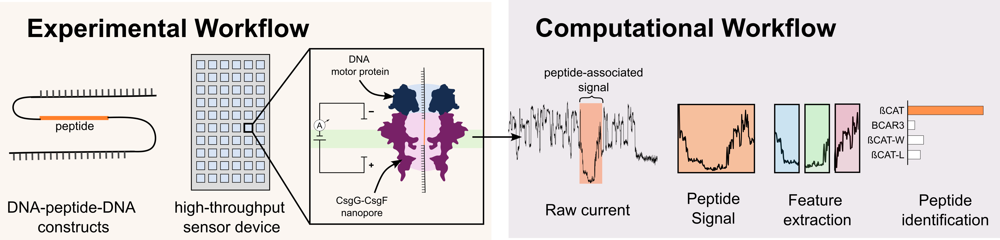

# A framework for peptide identification on nanopore sequencing platforms

[](https://doi.org/10.64898/2026.05.19.726067)

Nanopore peptide analysis workflow using Snakemake for preprocessing, signal segmentation, classification, and evaluation.



---

Pre-print:
- Beslic D, Kucklick M, Graap E, Sedaghatjoo S, Renard BY, Fuchs S, Engelmann S, Koerber N. A framework for peptide identification on commercial nanopore sequencing platforms. bioRxiv. 2026. https://doi.org/10.64898/2026.05.19.726067 
---

## Overview

This workflow performs:
1. POD5 preprocessing and Dorado basecalling
2. Read alignment to template references
3. Signal-level peptide segmentation
4. Feature extraction and classification
5. Evaluation and figure generation

The pipeline supports both local and SLURM-based execution.

---

## Repository Structure

```text
.
├── config/                 # Workflow configuration
├── data/                   # Input sequencing runs
├── Figures/                # Figure generation scripts
├── results/                # Processed outputs and intermediates
├── workflow/
│   ├── Snakefile           # Main workflow entrypoint
│   ├── rules/              # Snakemake rule definitions
│   └── scripts/            # Analysis scripts
├── environment.yml         # Conda/Mamba environment
├── local.sh                # Local workflow execution
├── slurm.sh                # SLURM workflow submission
└── README.md
```

---

## Installation

Create the environment using conda:

```bash
conda env create -p ./env -f environment.yml
conda activate ./env
```

### External Dependencies

Dorado is not installed automatically through the Conda environment and must be downloaded separately from Oxford Nanopore Technologies:
- https://github.com/nanoporetech/dorado

After installation, specify the Dorado executable path in:
```text
config/config.yml
```

---

## Input Data Structure

Place sequencing runs under:

```text
data/<run_name>/pod5/
```

Example:

```text
data/run01/pod5/
```

---

## Configuration

Main configuration file:

```text
config/config.yml
```

At minimum, verify:

```yaml
dorado_path:
dorado_model:
ref_fasta:
```

---

## Running the Workflow

### Local execution

```bash
bash local.sh
```

### SLURM execution

```bash
sbatch slurm.sh
```

---

## Figure Reproduction

The repository includes processed serialized `.pkl` files required to recreate the manuscript figures.

### Figure 2

```bash
python Figures/Figure2.py \
  --data-dir results/classification/features_dtw/ßCAT_single_variants/ \
  --output Figures/Figure2
```

### Figure 3

```bash
python Figures/Figure3.py \
  --data-dir results/classification/inceptiontime/ \
  --output Figures/Figure3 
```

### Figure 4

```bash
python Figures/Figure4.py \
  --data-dir results/classification/features_minirocket/ßCAT_single_variants/featuresLGBM/ \
  --output Figures/Figure4
```

---

## Reproducibility Notes

Basecalling with Dorado may produce slight run-to-run differences depending on:

- GPU architecture
- CUDA version
- Number of GPUs used
- Parallelization settings

Such variability has been reported in the Dorado issue tracker (https://github.com/nanoporetech/dorado/issues/617).

These effects may slightly affect individual read-level outputs and downstream counts but do not affect the conclusions of the study.

To ensure exact recreation of the published figures and reported metrics, this repository includes:

- serialized `.pkl` objects used for figure generation
- figure recreation scripts

Re-running the workflow from raw POD5 data may therefore yield slightly different numerical values, while preserving overall consistency of the results.

---

## Tested Environment

| Software | Version |
|---|---|
| Python | 3.11.13 |
| Snakemake | 9.3.2 |
| Dorado | 1.3.1 |
| CUDA | 12.5 |

Tested on NVIDIA A100, H100, H200, and L40 GPUs.

---

### Data Availability

Zenodo repository:
- https://doi.org/10.5281/zenodo.20269593 

Contents include:

- raw POD5 files
- processed FASTQ files
- alignment outputs
- classification results
